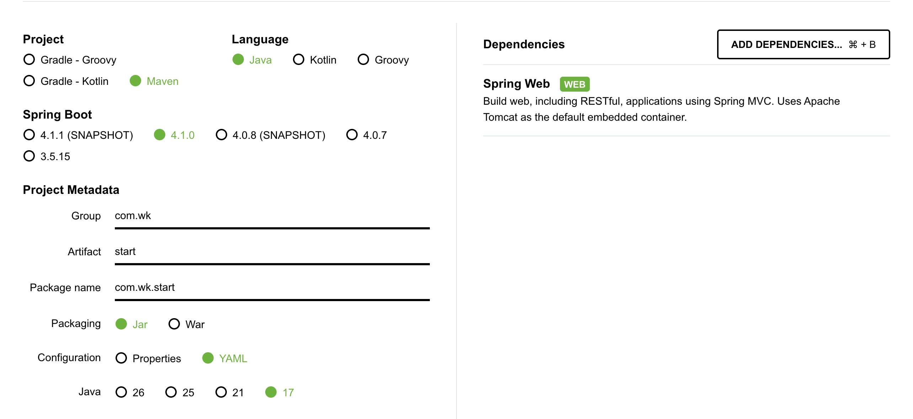
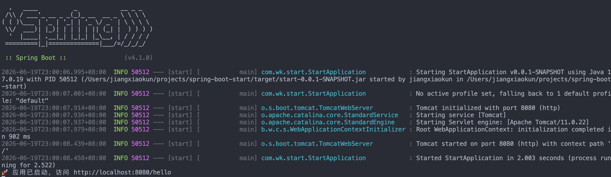

# spring-boot-start
Spring Boot 学习项目

## 项目配置
- 官方脚手架：[spring initializr](https://start.spring.io/)

### 配置表单（按需选择）
- Project: 选 Maven
- Language: 选 Java
- Spring Boot: 选 4.1.0 (稳定版)
- Project Metadata（项目源信息）
  - Group: com.wk（组织/公司域名倒写，例: com.google）
  - Artifact: start（项目名称）
  - Packaging: 选 Jar（SpringBoot 已经将 Tomcat 等内置了）
  - Configuration: 选 YAML（更简洁清晰）
  - Java: 选 17

**右侧 Dependencies**
- 点击`ADD Dependencies`, 搜索“Web”
- 选择`Spring Web`

### 生成标准项目
- 点击 `Generate` 会自动触发生成模板项目并下载
- 将项目拖进自己的 Git 仓库中
- 一键解压
```shell
bsdtar -xf start.zip --strip-components=1
```
- (可选) 如果没有提前创建 Git 仓库，可以直接 `unzip start.zip`, 然后运行 `git init`



## 项目运行
- 方法1：VS Code 在 main 函数直接有 `run` 的按钮
- 方法2：终端中运行 `mvn spring-boot:run`
- 方法3：`mvn clean package` 然后 `java -jar target/start-0.0.1-SNAPSHOT.jar`




